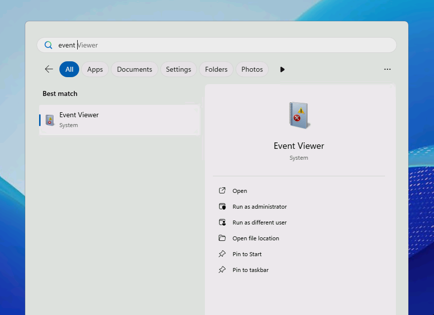
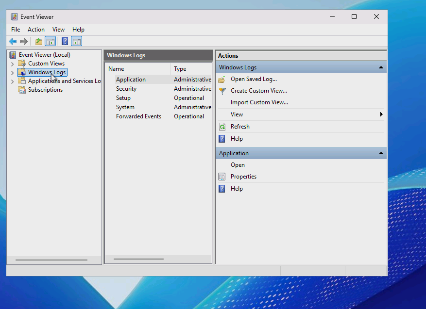
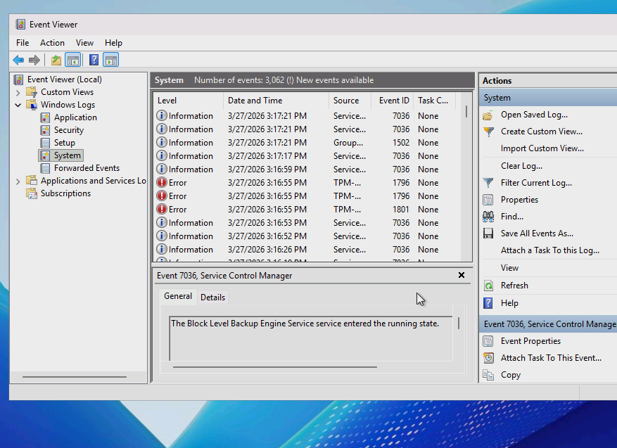
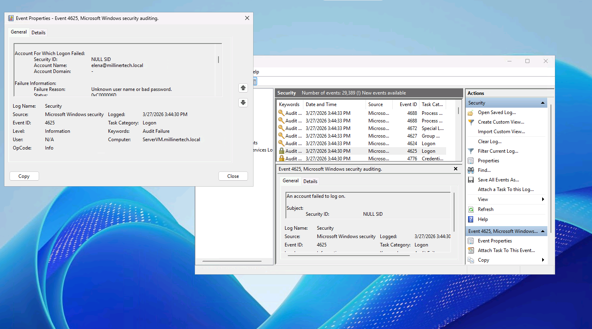
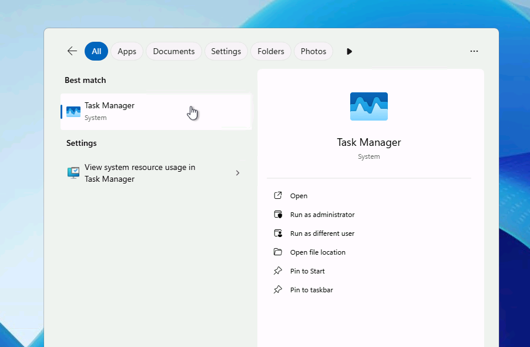
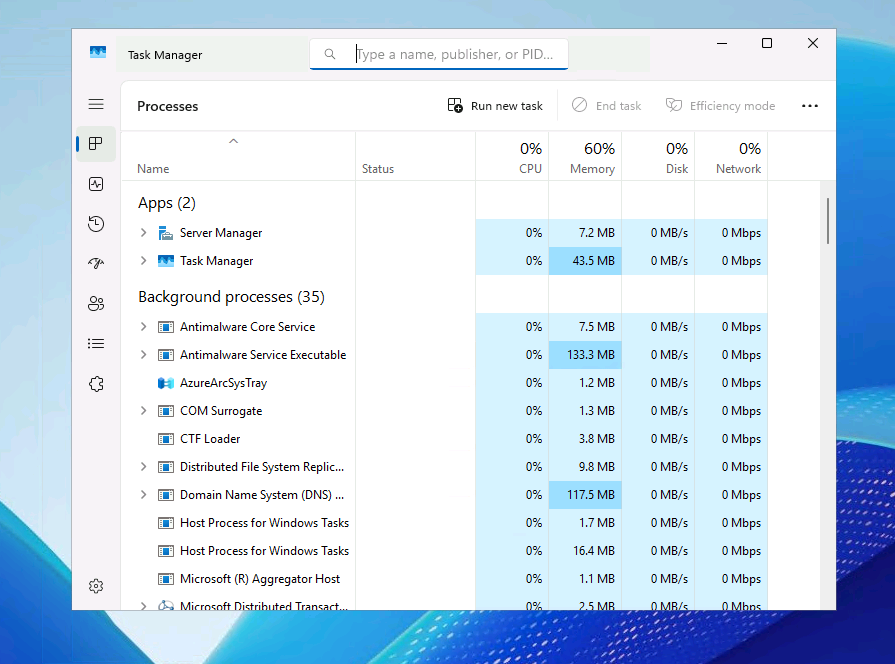
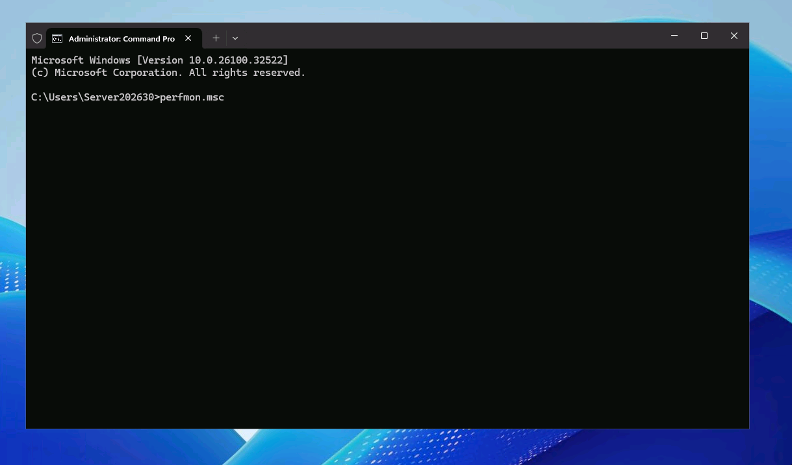
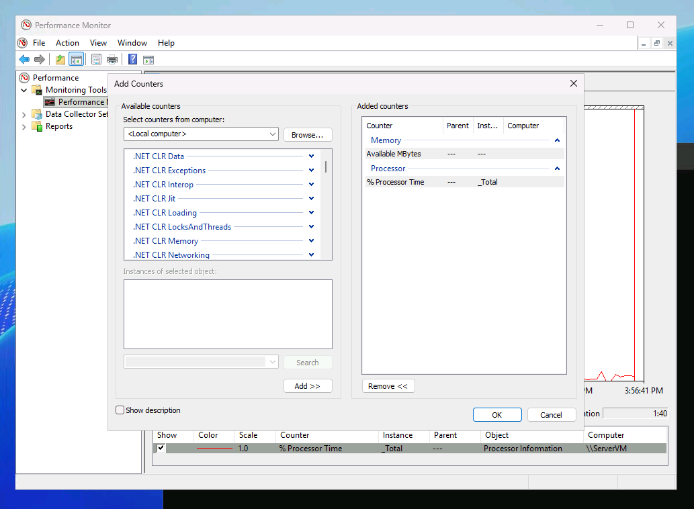
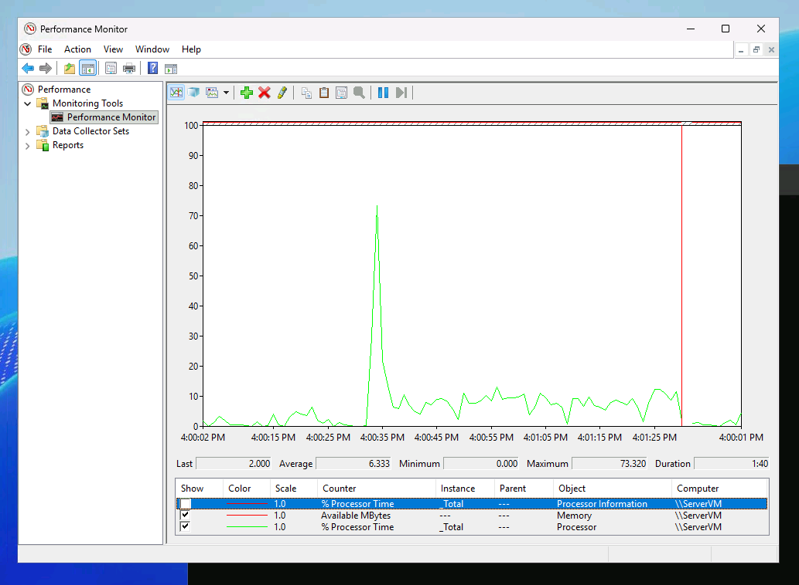

# Windows Server Monitoring & Event Logging Configuration (Sysadmin Lab)

### Viewing logs in Event Finder  

   

---
---

**Viewing a log of a "user" attempting to log in to the server with the wrong password.**  
   

---
---

### Monitoring in Task Manager  

   

---
---

### Advanced Monitoring in Performance Monitor  

